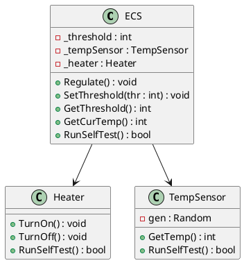
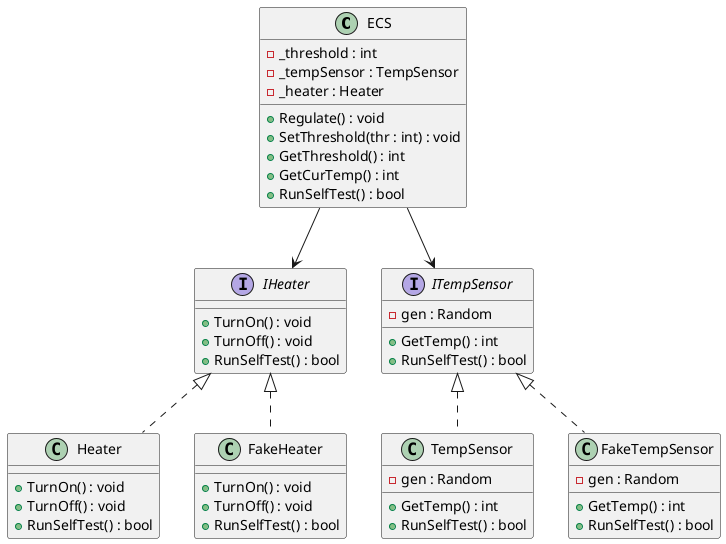

```plantuml
@startuml
class ECS { 
    - _threshold : int
    - _tempSensor : TempSensor
    - _heater : Heater
    + Regulate() : void
    + SetThreshold(thr : int) : void
    + GetThreshold() : int
    + GetCurTemp() : int
    + RunSelfTest() : bool
}

class Heater{
    + TurnOn() : void
    + TurnOff() : void
    + RunSelfTest() : bool
}

class TempSensor{
    - gen : Random
    + GetTemp() : int
    + RunSelfTest() : bool
}

ECS --> Heater
ECS --> TempSensor

@enduml
```
# Refactoring 

```plantuml 
@startuml
    
class ECS { 
    - _threshold : int
    - _tempSensor : TempSensor
    - _heater : Heater
    + Regulate() : void
    + SetThreshold(thr : int) : void
    + GetThreshold() : int
    + GetCurTemp() : int
    + RunSelfTest() : bool
}
interface IHeater { 
    + TurnOn() : void
    + TurnOff() : void
    + RunSelfTest() : bool
}
class Heater{
    + TurnOn() : void
    + TurnOff() : void
    + RunSelfTest() : bool
}
class FakeHeater{
    + TurnOn() : void
    + TurnOff() : void
    + RunSelfTest() : bool
}
interface ITempSensor { 
    - gen : Random
    + GetTemp() : int
    + RunSelfTest() : bool
}
class TempSensor{
    - gen : Random
    + GetTemp() : int
    + RunSelfTest() : bool
}
class FakeTempSensor { 
    - gen : Random
    + GetTemp() : int
    + RunSelfTest() : bool
}
ECS --> IHeater 
IHeater ^.. Heater
IHeater ^.. FakeHeater


ECS --> ITempSensor
ITempSensor ^.. TempSensor
ITempSensor ^.. FakeTempSensor
@enduml
```
